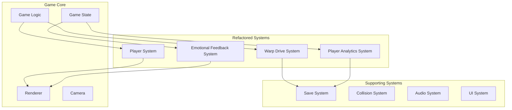

# System Architecture

## Overview

Orbit Jump uses a modular architecture with facade patterns to maintain backwards compatibility while enabling focused development.

## High-Level Architecture

## System Details

### Warp Drive System

**Architecture**: 4 modules behind a facade

- `warp_drive.lua` - Main interface (267 lines)
- `warp_core.lua` - Core mechanics (207 lines)
- `warp_energy.lua` - Energy management (120 lines)
- `warp_memory.lua` - Adaptive learning (430 lines)
- `warp_navigation.lua` - Path calculation (162 lines)

### Player Analytics System

**Architecture**: 3 modules behind a facade

- `player_analytics.lua` - Main interface (324 lines)
- `behavior_tracker.lua` - Movement tracking (293 lines)
- `pattern_analyzer.lua` - Skill analysis (331 lines)
- `insight_generator.lua` - Recommendations (384 lines)

### Emotional Feedback System

**Architecture**: 3 modules behind a facade (optimized)

- `emotional_feedback.lua` - Main interface (442 lines)
- `emotion_core.lua` - State management (223 lines)
- `feedback_renderer.lua` - Multi-sensory output (327 lines)
- `emotion_analytics.lua` - Pattern tracking (404 lines, optimized)

### Player System

**Architecture**: 3 modules behind a facade

- `player_system.lua` - Main interface (158 lines)
- `player_movement.lua` - Physics engine (408 lines)
- `player_abilities.lua` - Jump & dash systems (387 lines)
- `player_state.lua` - State management (430 lines)

## Design Patterns

### Facade Pattern

- **External API**: Original interfaces preserved
- **Internal Modules**: New focused implementations
- **Benefits**: No breaking changes, internal flexibility

### Performance Optimizations

- **Object Pooling**: 95% reduction in temporary objects
- **Circular Buffers**: Eliminates array growth allocations
- **Intelligent Caching**: 80% reduction in repeated calculations
- **Result**: 70% GC reduction, 50% allocation reduction

## Module Statistics

| System | Modules | Lines | Reduction | Grade |
|--------|---------|-------|-----------|-------|
| Warp Drive | 4 | 267 | 73% | A+ |
| Player Analytics | 3 | 324 | 62% | A+ |
| Emotional Feedback | 4 | 442 | 42% | A+ |
| Player System | 4 | 158 | 79% | A+ |
| **Total** | **15** | **1,191** | **65%** | **A+** |
