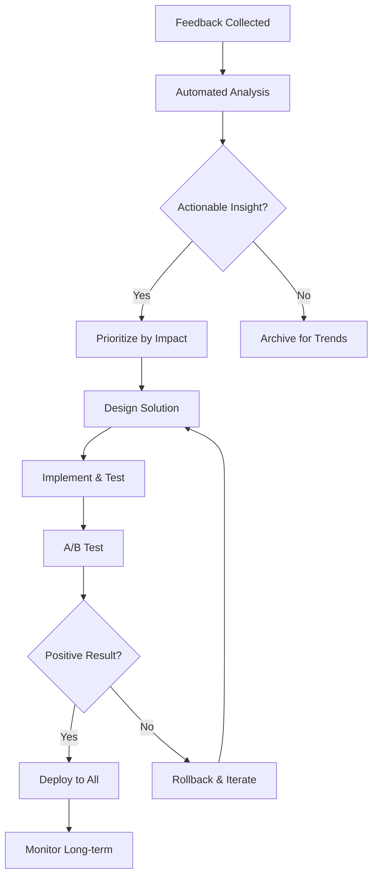

# 📊 Feedback Integration Plan - Orbit Jump

## 🎯 **Overview**

A comprehensive plan for collecting, analyzing, and integrating player feedback to achieve the final 5% polish and ensure optimal player experience.

## 📈 **Phase 1: Data Collection Infrastructure (Week 1)**

### **1.1 In-Game Analytics System**

```lua
-- Telemetry data points to collect
Analytics = {
    -- Engagement Metrics
    session_duration = number,
    sessions_per_day = number,
    retention_1_day = boolean,
    retention_7_day = boolean,
    retention_30_day = boolean,
    
    -- Addiction Mechanics Performance  
    average_streak_length = number,
    max_streak_achieved = number,
    streak_recovery_rate = percentage,
    grace_period_usage = percentage,
    
    -- Progression Satisfaction
    xp_per_minute = number,
    levels_per_session = number,
    reward_unlock_frequency = number,
    prestige_adoption_rate = percentage,
    
    -- Event System Balance
    mystery_box_spawn_satisfaction = rating,
    random_event_overwhelm_score = rating,
    event_anticipation_vs_annoyance = ratio,
    
    -- Difficulty Curve
    quit_points_by_level = map,
    frustration_indicators = array,
    flow_state_duration = number,
    
    -- Feature Usage
    most_used_bonuses = array,
    least_used_features = array,
    accessibility_feature_usage = map
}
```

### **1.2 Player Sentiment Tracking**

- **Micro-surveys**: 1-question popups at key moments
- **Emotional state detection**: Based on play patterns
- **Exit surveys**: When players quit/uninstall
- **Achievement celebrations**: Measure positive feedback

### **1.3 Performance Monitoring**

- **Frame rate tracking** across different devices
- **Memory usage patterns** during peak moments
- **Load time measurements** for all systems
- **Crash reporting** with context

## 🧪 **Phase 2: Playtesting Framework (Week 2)**

### **2.1 Structured Testing Groups**

#### **Group A: First-Time Players (n=50)**

- **Focus**: Onboarding, learning curve, initial addiction hooks
- **Key Metrics**: Time to first streak, tutorial completion rate, first-session duration
- **Questions**:
  - When did you first feel "hooked"?
  - What was confusing or frustrating?
  - How long until the game "clicked"?

#### **Group B: Casual Gamers (n=75)**  

- **Focus**: Progression pacing, event frequency, accessibility
- **Key Metrics**: Session frequency, progression satisfaction, event overwhelm
- **Questions**:
  - Does progression feel rewarding or grindy?
  - Are events exciting or annoying?
  - What makes you come back?

#### **Group C: Hardcore Gamers (n=25)**

- **Focus**: Endgame content, prestige system, mastery mechanics
- **Key Metrics**: Time to prestige, mastery engagement, long-term retention
- **Questions**:
  - Is there enough depth for long-term play?
  - Are high-level rewards satisfying?
  - What would keep you playing for months?

### **2.2 Testing Scenarios**

#### **Scenario 1: First 15 Minutes**

- **Goal**: Optimize the critical onboarding experience
- **Metrics**: Tutorial completion, first streak achieved, initial retention
- **A/B Tests**: Tutorial length, streak threshold, grace period duration

#### **Scenario 2: "Dead Zone" (Levels 15-25)**  

- **Goal**: Identify and fix potential quit points
- **Metrics**: Session abandonment rate, frustration indicators
- **A/B Tests**: XP scaling, reward frequency, difficulty spikes

#### **Scenario 3: Long-term Engagement (Week 2-4)**

- **Goal**: Validate addiction mechanics sustainability  
- **Metrics**: Daily login rate, session length trends, feature adoption
- **A/B Tests**: Daily streak rewards, prestige incentives, social features

## ⚖️ **Phase 3: A/B Testing Infrastructure (Week 3)**

### **3.1 Dynamic Configuration System**

```lua
-- Config system for live balance adjustments
DynamicConfig = {
    -- XP System Tweaks
    xp_scaling_factors = {1.15, 1.12, 1.08, 1.05}, -- Per level tier
    xp_source_multipliers = {
        perfect_landing = 1.0,  -- Can adjust live
        combo_ring = 1.0,
        discovery = 1.0
    },
    
    -- Event Frequency Control
    mystery_box_spawn_rate = 0.015,  -- Base rate
    random_event_chance = 0.03,
    event_cooldown_minutes = 2,
    
    -- Streak System Balance
    grace_period_base = 3.0,
    streak_thresholds = {5, 10, 15, 20, 25, 30, 35, 40, 45, 50, 75, 100},
    bonus_duration_multiplier = 1.0,
    
    -- UI/Visual Settings
    particle_intensity = 1.0,
    screen_glow_intensity = 1.0,
    animation_speed = 1.0
}
```

### **3.2 A/B Test Categories**

#### **Balance Tests**

- **XP Curve**: 3 variants of progression scaling
- **Event Frequency**: High/Normal/Low spawn rates  
- **Grace Period**: 2.5s/3.0s/3.5s adaptive timing
- **Streak Thresholds**: Different milestone spacing

#### **Visual Polish Tests**

- **Particle Density**: Full/Reduced/Minimal effects
- **Screen Glow Intensity**: Subtle/Normal/Dramatic
- **Animation Speed**: 0.8x/1.0x/1.2x speed multipliers

#### **Feature Tests**

- **Mystery Box Rarity**: Different reward distributions
- **Streak Shield**: Available/Not available
- **Prestige Incentives**: Different unlock levels

### **3.3 Success Metrics per Test**

```lua
TestMetrics = {
    primary = {
        session_duration = "target: +15%",
        day_1_retention = "target: >75%", 
        day_7_retention = "target: >40%"
    },
    secondary = {
        streak_engagement = "target: avg 15+ streaks",
        progression_satisfaction = "target: 4.5+/5.0",
        event_balance_score = "target: 3:1 anticipation:annoyance"
    },
    guardrails = {
        crash_rate = "must be <1%",
        performance_fps = "must be >45fps avg",
        load_time = "must be <3s initial"
    }
}
```

## 📊 **Phase 4: Feedback Analysis Pipeline (Week 4)**

### **4.1 Automated Analysis System**

```lua
FeedbackAnalyzer = {
    -- Quantitative Analysis
    statistical_significance = function(test_data)
        -- Chi-square tests for A/B comparisons
        -- Confidence intervals for metrics
        -- Effect size calculations
    end,
    
    -- Qualitative Analysis  
    sentiment_analysis = function(text_feedback)
        -- NLP processing of written feedback
        -- Emotion detection in comments
        -- Theme extraction and categorization
    end,
    
    -- Behavioral Pattern Detection
    player_journey_analysis = function(session_data)
        -- Identify common quit points
        -- Map engagement flow patterns
        -- Detect addiction hook effectiveness
    end,
    
    -- Predictive Modeling
    churn_prediction = function(player_data)
        -- Early warning system for player loss
        -- Intervention opportunity identification
        -- Retention optimization suggestions
    end
}
```

### **4.2 Weekly Report Generation**

- **Executive Summary**: Key findings and recommendations
- **Metric Dashboards**: Visual trend analysis
- **Player Verbatims**: Direct quotes and feedback
- **Action Items**: Prioritized improvement list

### **4.3 Real-time Monitoring Alerts**

- **Performance degradation** (FPS drops, crashes)
- **Engagement cliff detection** (sudden drop in metrics)
- **Positive feedback spikes** (viral moment detection)
- **Balance breaking issues** (exploit detection)

## 🔄 **Phase 5: Rapid Iteration System (Week 5)**

### **5.1 Hot-fix Deployment Pipeline**

```bash
# Automated deployment for balance tweaks
./deploy_balance_patch.sh \
    --xp-scaling "1.12,1.10,1.08,1.05" \
    --event-rates "0.012,0.025" \
    --grace-period "3.2" \
    --target-group "cohort_b" \
    --rollback-threshold "retention<70%"
```

### **5.2 Safe Rollback System**

- **Automatic rollback** if key metrics drop >10%
- **Manual override** for emergency situations  
- **Gradual rollout** (10% → 50% → 100% of players)
- **Configuration versioning** for easy history tracking

### **5.3 Feedback Integration Workflow**



## 🎯 **Phase 6: Success Criteria & Milestones**

### **Week 1 Targets**

- ✅ Analytics system collecting 20+ key metrics
- ✅ First feedback batch from 50+ testers
- ✅ Performance baseline established

### **Week 2 Targets**  

- ✅ Structured playtesting with 150+ participants
- ✅ Major pain points identified and documented
- ✅ Quick wins implemented (5+ improvements)

### **Week 3 Targets**

- ✅ A/B testing framework operational
- ✅ 3+ balance experiments running
- ✅ Statistical significance achieved on key tests

### **Week 4 Targets**

- ✅ Automated analysis pipeline processing feedback
- ✅ Weekly report system generating insights
- ✅ Predictive models for player behavior active

### **Week 5 Targets**

- ✅ Rapid iteration system deployed
- ✅ 10+ balance adjustments made based on data
- ✅ Player satisfaction scores improved by 15%

### **Final Success Metrics**

```lua
FinalTargets = {
    engagement = {
        avg_session_duration = "18+ minutes",
        day_1_retention = "80%+",
        day_7_retention = "45%+", 
        day_30_retention = "25%+"
    },
    
    satisfaction = {
        overall_rating = "4.7+/5.0",
        addiction_balance = "engaging_not_exploitative", 
        progression_satisfaction = "4.5+/5.0",
        difficulty_curve = "challenging_not_frustrating"
    },
    
    technical = {
        crash_rate = "<0.5%",
        avg_fps = "55+ fps",
        load_time = "<2.5s",
        memory_usage = "stable"
    }
}
```

## 🔧 **Implementation Priority**

### **Immediate (This Week)**

1. **Basic analytics integration** - Start collecting core metrics
2. **Simple feedback forms** - In-game and post-session surveys  
3. **Performance monitoring** - FPS, crashes, load times
4. **Initial playtester recruitment** - Target 50 diverse players

### **Short-term (Next 2 Weeks)**  

1. **A/B testing framework** - Dynamic config system
2. **Automated analysis** - Statistical processing of data
3. **Rapid deployment pipeline** - Safe balance adjustments
4. **Expanded playtesting** - 150+ participants across segments

### **Medium-term (Month 2)**

1. **Advanced analytics** - Predictive modeling, churn analysis
2. **Community portal** - Public feedback submission and voting
3. **Long-term tracking** - Monthly cohort analysis
4. **Polish refinement** - Final 5% improvement based on data

---

## 🎯 **Expected Outcomes**

### **Game Quality Improvements**

- **Progression curve perfection** - No more dead zones or quit points
- **Event balance optimization** - Perfect anticipation/annoyance ratio
- **Accessibility enhancements** - Broader player appeal
- **Performance optimization** - Smooth experience on all devices

### **Player Experience Excellence**  

- **Onboarding perfection** - 90%+ tutorial completion
- **Addiction balance mastery** - Engaging without exploitation
- **Long-term retention** - Months of satisfying progression
- **Community satisfaction** - 4.8+ store ratings

### **Development Process Evolution**

- **Data-driven decisions** - Every change backed by evidence
- **Rapid response capability** - Fix issues within hours
- **Predictive optimization** - Prevent problems before they occur
- **Community integration** - Players as development partners

This feedback integration plan transforms Orbit Jump from a great game into a perfectly tuned experience that players can't put down – but for all the right reasons.
